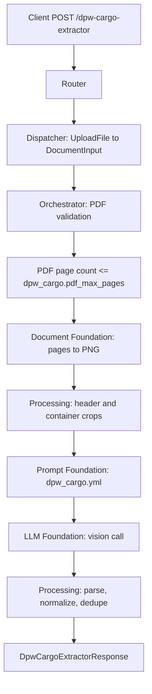

# DPW Cargo Extractor API

Extracts receipt date, receipt number, and container references from a DP World cargo receipt PDF.

## V1_REQUIREMENT

- Accept one uploaded PDF as `file`.
- Validate PDF page count before rendering or model extraction.
- Use the configured `dpw_cargo.pdf_max_pages` value from `config/apis/document_defaults.yml`.
- Default configured PDF page limit is `10`.
- Use the dedicated `config/prompts/dpw_cargo.yml` prompt.
- Render valid PDF pages once and send optimized header/container crops in one vision call.
- Return a flat response containing extracted fields, LLM metadata, and `error`.
- On errors, keep all extraction fields and metadata as `null`, and populate `error`.

## Endpoint

POST `/dpw-cargo-extractor`

## Description

This endpoint reads DPW cargo receipt PDFs and extracts:

- `date`: receipt header `Date`, normalized to `DD/MM/YYYY`.
- `containers`: all valid container values shown after `Container` labels in charge rows.
- `receipt_no`: receipt header `Receipt No`, or visible BOL/B/L reference if used as the receipt reference.
- `total_containers`: count of unique normalized containers.
- `pages_processed`: number of rendered PDF pages actually processed.

The workflow does not infer missing values. If a field is absent or unreadable, the field is returned as `null`, except `containers`, which returns an empty list on successful extraction.

## Headers

| Header | Required | Value |
| --- | --- | --- |
| `Content-Type` | Yes | `multipart/form-data` |

## API Parameters

| Name | Location | Type | Required | Description |
| --- | --- | --- | --- | --- |
| `file` | form file | PDF | Yes | DPW cargo receipt PDF. PDFs must not exceed the configured page limit. |

## E2E Workflow

1. Router accepts the uploaded PDF.
2. Dispatcher reads the upload into `SingleDocumentCommand`.
3. Orchestrator validates that the file is a PDF.
4. Orchestrator reads PDF page count and rejects files over `dpw_cargo.pdf_max_pages`.
5. Document foundation renders valid PDF pages to PNG.
6. Processing builds compact header and charge-description crops to reduce vision payload size.
7. Prompt foundation loads `dpw_cargo.yml`.
8. LLM foundation runs one multi-image vision extraction call.
9. Processing parses strict JSON, normalizes date/receipt/container values, removes duplicate containers, and sets `pages_processed`.
10. Router returns the flat DPW response or a contract-shaped error body.



## Request Schema

```text
multipart/form-data

file: binary PDF file, required
```

## Success Response Schema

```json
{
  "date": "DD/MM/YYYY|null",
  "containers": ["string"],
  "total_containers": 0,
  "pages_processed": 0,
  "receipt_no": "string|null",
  "metadata": {
    "input_tokens": 0,
    "output_tokens": 0,
    "total_tokens": 0,
    "cost_incurred": 0.0,
    "cost_currency": "USD",
    "latency_ms": 0.0,
    "model": "gpt-4o"
  },
  "error": null
}
```

## Example Request

```bash
curl -X 'POST' \
  'http://localhost:8005/dpw-cargo-extractor' \
  -H 'accept: application/json' \
  -H 'Content-Type: multipart/form-data' \
  -F 'file=@DPW PAYMENT-1.pdf;type=application/pdf'
```

## Example Response

```json
{
  "date": "08/06/2026",
  "containers": [
    "BSIU314828",
    "DPWU200491",
    "DPWU201512"
  ],
  "total_containers": 3,
  "pages_processed": 6,
  "receipt_no": "56710421",
  "metadata": {
    "input_tokens": 1800,
    "output_tokens": 120,
    "total_tokens": 1920,
    "cost_incurred": 0.00384,
    "cost_currency": "USD",
    "latency_ms": 3200.5,
    "model": "gpt-4o"
  },
  "error": null
}
```

## Empty Extraction Response

```json
{
  "date": null,
  "containers": [],
  "total_containers": 0,
  "pages_processed": 1,
  "receipt_no": null,
  "metadata": {
    "input_tokens": 500,
    "output_tokens": 30,
    "total_tokens": 530,
    "cost_incurred": 0.0018,
    "cost_currency": "USD",
    "latency_ms": 1300.0,
    "model": "gpt-4o"
  },
  "error": null
}
```

## Error Response

Status: `400`, `502`, `503`, or `500` depending on the failure.

```json
{
  "date": null,
  "containers": null,
  "total_containers": null,
  "pages_processed": null,
  "receipt_no": null,
  "metadata": null,
  "error": "PDF exceeds maximum allowed pages"
}
```

## Real example:

- curl
```
curl -X 'POST' \
  'http://localhost:8000/dpw-cargo-extractor' \
  -H 'accept: application/json' \
  -H 'Content-Type: multipart/form-data' \
  -F 'file=@DPW PAYMENT-1 BL-MUNKLF26139815.pdf;type=application/pdf'

```

- Response

```

{
  "date": "08/06/2026",
  "containers": [
    "BSIU314828",
    "DPWU200491",
    "DPWU201512",
    "DPWU202048",
    "DPWU202277",
    "DPWU202406",
    "DPWU203386",
    "DPWU207991",
    "DPWU212177",
    "DPWU213015",
    "DPWU214023",
    "DPWU214845",
    "DPWU215663",
    "DPWU216085",
    "DPWU216268",
    "DPWU221602",
    "DRYU286212",
    "FYCU723869",
    "FYCU724060",
    "FYCU724092",
    "LEGU201592",
    "LEGU201628",
    "LEGU201822",
    "LEGU202374",
    "LEGU202423",
    "LEGU203017",
    "LEGU203212",
    "LEGU203363",
    "LEGU203387",
    "LEGU203446",
    "LEGU203458",
    "LEGU203716",
    "LEGU203786",
    "LEGU203920",
    "SEGU234612",
    "SEGU397342",
    "SEKU113029",
    "TIIU234250",
    "TLLU361240"
  ],
  "total_containers": 39,
  "pages_processed": 6,
  "receipt_no": "56710421",
  "metadata": {
    "input_tokens": 8283,
    "output_tokens": 219,
    "total_tokens": 8502,
    "cost_incurred": 0.017561,
    "cost_currency": "USD",
    "latency_ms": 8050.89,
    "model": "gpt-5.2"
  },
  "error": null
}
```

## Extraction Rules

### date

- Use the header field labelled `Date`.
- Accept values with time, such as `08/06/2026 13:30`.
- Return only the date in `DD/MM/YYYY`.
- Do not use `Arr Date`, storage date ranges, payment dates, footer dates, or due dates.
- Return `null` if the receipt date is absent or unreadable.

### containers

- Extract values directly after visible `Container` labels in charge-description rows.
- Process all pages in document order.
- Trim whitespace and remove spaces/hyphens inside container values.
- Normalize to uppercase.
- Accept four letters followed by six or seven digits.
- Remove duplicates while preserving first-seen order.
- Do not extract `CONTAINERS TaxCode` text as a container number.
- Return `[]` if no valid containers are found.

### receipt_no

- Prefer the header field labelled `Receipt No`.
- If `Receipt No` is blank and a BOL/B/L reference is visibly used as the receipt reference, return that value.
- Do not use `DO No`, `B/E No`, `Transaction Id`, `Rotation`, `TRN`, customer reference, or page numbers.
- Trim whitespace and remove line breaks inside the value.
- Return `null` if no receipt reference is visible.

## Error Responses

| Status | When | Shape |
| --- | --- | --- |
| `400` | Missing file, unsupported type, unreadable PDF, PDF over page limit | `DpwCargoExtractorResponse` with `error` populated |
| `502` | LLM JSON is invalid or fails schema validation | `DpwCargoExtractorResponse` with `error` populated |
| `503` | Required prompt/config is missing | `DpwCargoExtractorResponse` with `error` populated |
| `500` | Unexpected workflow failure | `DpwCargoExtractorResponse` with `error` populated |

## Swagger Docs Details

Open Swagger UI at `/docs`.

Swagger should show:

- Tag: `dpw-cargo`
- Method: `POST`
- Path: `/dpw-cargo-extractor`
- Summary: `Extract date, receipt number, and containers from a DPW cargo receipt PDF`
- Request body: `multipart/form-data`
- Response model: `DpwCargoExtractorResponse`
- File field: `file`

## Future Requirement Slots

### V2_REQUIREMENT

Add here if the API later needs invoice totals, payment details, B/E number, DO number, vessel, rotation, customer information, or line-level charge extraction.
