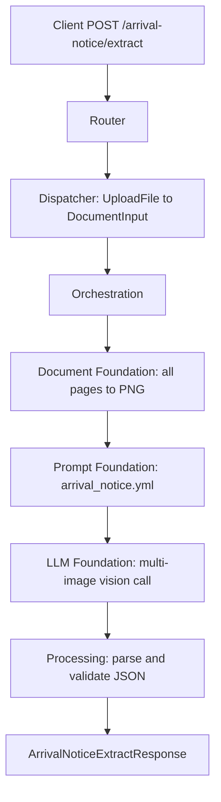

# Arrival Notice Extract API

Extracts `print_date`, `arrival_on`, and `free_retension_days` from an arrival notice or related shipping document.

## V1_REQUIREMENT

- Accept one uploaded PDF or image as `file`.
- For PDFs, render all pages and send them in one multi-image vision call.
- For images, normalize the image to PNG and send it as one page.
- Validate date outputs as `YYYY-MM-DD` or `null`.
- Normalize free retention time to `"N days"` or `null`.
- Preserve direct async request/response behavior.

## Endpoint

POST `/arrival-notice/extract`

## Description

This endpoint is used when the user needs the printed date, arrival date, and free retention period from shipping or arrival paperwork. The workflow is strict: model output must be JSON and must match the response schema.

## Headers

| Header | Required | Value |
| --- | --- | --- |
| `Content-Type` | Yes | `multipart/form-data` |

## API Parameters

| Name | Location | Type | Required | Description |
| --- | --- | --- | --- | --- |
| `file` | form file | PDF/JPG/JPEG/PNG | Yes | Arrival notice or related shipping document. PDFs use all pages. |

## E2E Workflow

1. Router accepts the uploaded file.
2. Dispatcher reads the upload into `SingleDocumentCommand`.
3. Orchestrator validates file type.
4. Document foundation renders all PDF pages or one image page to PNG.
5. Prompt foundation loads `arrival_notice.yml`.
6. LLM foundation runs one vision request with all rendered pages.
7. Processing strips JSON fences, parses JSON, and validates fields.
8. Router returns the validated response or maps errors to HTTP status codes.



## Request Schema

```text
multipart/form-data

file: binary file, required
```

## Response Schema

```json
{
  "print_date": "YYYY-MM-DD|null",
  "arrival_on": "YYYY-MM-DD|null",
  "free_retension_days": "N days|null",
  "metadata": {
    "input_tokens": 0,
    "output_tokens": 0,
    "total_tokens": 0,
    "cost_incurred": 0.0,
    "cost_currency": "USD",
    "latency_ms": 0.0,
    "model": "gpt-4o"
  }
}
```

## Example Request

```bash
curl -X POST \
  "http://localhost:8000/arrival-notice/extract" \
  -H "accept: application/json" \
  -F "file=@./samples/arrival_notice.pdf;type=application/pdf"
```

## Example Response

```json
{
  "print_date": "2026-03-01",
  "arrival_on": "2026-03-03",
  "free_retension_days": "14 days",
  "metadata": {
    "input_tokens": 600,
    "output_tokens": 120,
    "total_tokens": 720,
    "cost_incurred": 0.0027,
    "cost_currency": "USD",
    "latency_ms": 1800.42,
    "model": "gpt-4o"
  }
}
```

## Error Responses

| Status | When | Shape |
| --- | --- | --- |
| `400` | Missing file, unsupported type, unreadable PDF/image | `{"detail": "..."}` |
| `502` | LLM JSON is invalid or fails schema validation | `{"detail": "LLM response could not be validated: ..."}` |
| `503` | Required prompt/config is missing | `{"detail": "..."}` |
| `500` | Unexpected workflow failure | `{"detail": "Extraction failed: ..."}` |

## Swagger Docs Details

Open Swagger UI at `/docs`.

Swagger should show:

- Tag: `arrival-notice`
- Method: `POST`
- Path: `/arrival-notice/extract`
- Summary: `Extract arrival date and free retention days from arrival notice`
- Request body: `multipart/form-data`
- Response model: `ArrivalNoticeExtractResponse`
- File field: `file`

## Future Requirement Slots

### V2_REQUIREMENT

Add here if the API later needs extra fields such as vessel, voyage, container number, or separate free detention/free demurrage values.
