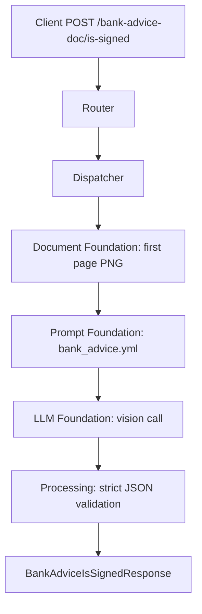

# Bank Advice Is Signed API

Detects whether a bank advice document contains a visible handwritten signature and a visible seal/stamp.

## V1_REQUIREMENT

- Accept one uploaded PDF or image as `file`.
- For PDFs, analyze first page only.
- Return strict booleans: `is_signed` and `is_sealed`.
- Do not count printed text as a handwritten signature.
- Do not count printed logos as seals.
- Preserve direct async request/response behavior.

## Endpoint

POST `/bank-advice-doc/is-signed`

## Description

This endpoint is used for trade finance or bank advice documents where the user needs a simple yes/no decision for handwritten signature presence and stamp/seal presence.

## Headers

| Header | Required | Value |
| --- | --- | --- |
| `Content-Type` | Yes | `multipart/form-data` |

## API Parameters

| Name | Location | Type | Required | Description |
| --- | --- | --- | --- | --- |
| `file` | form file | PDF/JPG/JPEG/PNG | Yes | Bank advice document. PDFs use first page only. |

## E2E Workflow

1. Router receives uploaded bank advice file.
2. Dispatcher reads bytes into `SingleDocumentCommand`.
3. Orchestrator validates type and renders first page to PNG.
4. Prompt foundation loads `bank_advice.yml`.
5. LLM foundation sends one vision request.
6. Processing validates strict LLM JSON with `is_signed` and `is_sealed`.
7. Response includes booleans and metadata.



## Request Schema

```text
multipart/form-data

file: binary file, required
```

## Response Schema

```json
{
  "is_signed": true,
  "is_sealed": true,
  "metadata": {
    "input_tokens": 0,
    "output_tokens": 0,
    "total_tokens": 0,
    "cost_incurred": 0.0,
    "cost_currency": "USD",
    "latency_ms": 0.0,
    "model": "gpt-4o"
  }
}
```

## Example Request

```bash
curl -X POST \
  "http://localhost:8000/bank-advice-doc/is-signed" \
  -H "accept: application/json" \
  -F "file=@./samples/bank_advice.pdf;type=application/pdf"
```

## Example Response

```json
{
  "is_signed": true,
  "is_sealed": false,
  "metadata": {
    "input_tokens": 420,
    "output_tokens": 40,
    "total_tokens": 460,
    "cost_incurred": 0.00145,
    "cost_currency": "USD",
    "latency_ms": 1100.25,
    "model": "gpt-4o"
  }
}
```

## Error Responses

| Status | When | Shape |
| --- | --- | --- |
| `400` | Missing file, unsupported type, unreadable PDF/image | `{"detail": "..."}` |
| `502` | LLM JSON is invalid or missing required booleans | `{"detail": "LLM response could not be validated: ..."}` |
| `503` | Required prompt/config is missing | `{"detail": "..."}` |
| `500` | Unexpected workflow failure | `{"detail": "Signature detection failed: ..."}` |

## Swagger Docs Details

Open Swagger UI at `/docs`.

Swagger should show:

- Tag: `bank-advice`
- Method: `POST`
- Path: `/bank-advice-doc/is-signed`
- Summary: `Detect handwritten signature and seal on bank advice (PDF first page or image)`
- Request body: `multipart/form-data`
- Response model: `BankAdviceIsSignedResponse`
- File field: `file`

## Future Requirement Slots

### V2_REQUIREMENT

Add here if the API later needs signature confidence, seal confidence, bounding boxes, signer name extraction, or multi-page scanning.
