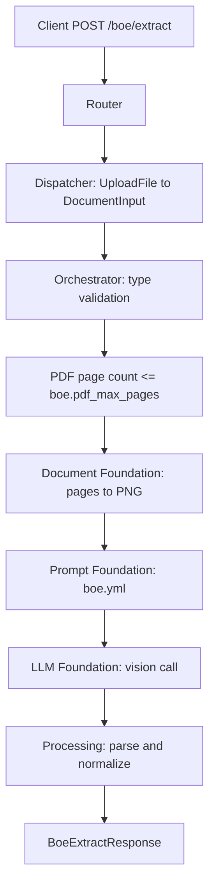

# BOE Extract API

Extracts container numbers and the DCE date from a Bill of Entry (BOE) document.

## V1_REQUIREMENT

- Accept one uploaded PDF or image as `file`.
- Supported formats: PDF, PNG, JPG, JPEG.
- Validate PDF page count before rendering or model extraction.
- Use the configured `boe.pdf_max_pages` value from `config/apis/document_defaults.yml`.
- Default configured PDF page limit is `2`.
- Use the dedicated `config/prompts/boe.yml` prompt.
- Return `success`, extracted `data`, and LLM `metadata`.

## Endpoint

POST `/boe/extract`

## Description

This endpoint reads BOE documents and extracts:

- `containers`: all values after `Container Nos:` inside the `MARKS & NUMBERS` section.
- `date`: the value labelled `DCE DATE` or `DEC DATE`, normalized to `DD/MM/YYYY`.

The workflow does not infer missing values. If containers or DCE date are absent, it returns an empty container list and `null` date.

## Headers

| Header | Required | Value |
| --- | --- | --- |
| `Content-Type` | Yes | `multipart/form-data` |

## API Parameters

| Name | Location | Type | Required | Description |
| --- | --- | --- | --- | --- |
| `file` | form file | PDF/JPG/JPEG/PNG | Yes | BOE document. PDFs must not exceed the configured page limit. |

## E2E Workflow

1. Router accepts the uploaded file.
2. Dispatcher reads the upload into `SingleDocumentCommand`.
3. Orchestrator validates file type.
4. For PDFs, orchestrator reads page count and rejects files over `boe.pdf_max_pages`.
5. Document foundation renders valid PDF pages or one image page to PNG.
6. Prompt foundation loads `boe.yml`.
7. LLM foundation runs one multi-image vision extraction call.
8. Processing parses strict JSON, removes duplicate containers, trims whitespace, and normalizes DCE/DEC date.
9. Router returns the BOE response or a BOE validation error body.



## Request Schema

```text
multipart/form-data

file: binary file, required
```

## Success Response Schema

```json
{
  "success": true,
  "data": {
    "containers": ["string"],
    "date": "DD/MM/YYYY|null"
  },
  "metadata": {
    "input_tokens": 0,
    "output_tokens": 0,
    "total_tokens": 0,
    "cost_incurred": 0.0,
    "cost_currency": "USD",
    "latency_ms": 0.0,
    "model": "gpt-4o"
  }
}
```

## Example Request

```bash
curl -X 'POST' \
  'http://localhost:8005/boe/extract' \
  -H 'accept: application/json' \
  -H 'Content-Type: multipart/form-data' \
  -F 'file=@BOE-doc.pdf;type=application/pdf'
```

## Example Response

```json
{
  "success": true,
  "data": {
    "containers": [
      "CBHU3475526",
      "CLHU3820005",
      "DVRU1599581",
      "GLDU5290979",
      "HHXU3335546",
      "TCLU2543237",
      "TRHU1781370",
      "TRLU3389455",
      "TRLU8792600",
      "UETU2851172"
    ],
    "date": null
  },
  "metadata": {
    "input_tokens": 3218,
    "output_tokens": 74,
    "total_tokens": 3292,
    "cost_incurred": 0.006667,
    "cost_currency": "USD",
    "latency_ms": 4925.31,
    "model": "gpt-5.2"
  }
}
```

## Empty Extraction Response

```json
{
  "success": true,
  "data": {
    "containers": [],
    "date": null
  },
  "metadata": {
    "input_tokens": 500,
    "output_tokens": 30,
    "total_tokens": 530,
    "cost_incurred": 0.0018,
    "cost_currency": "USD",
    "latency_ms": 1300.0,
    "model": "gpt-4o"
  }
}
```

## Validation Error Response

Status: `400`

```json
{
  "success": false,
  "message": "PDF exceeds maximum allowed pages"
}
```

## Extraction Rules

### containers

- Locate `MARKS & NUMBERS`.
- Inside that section, find `Container Nos:`.
- Extract all container numbers after that label.
- Handle comma-separated and multi-line lists.
- Trim surrounding whitespace.
- Remove duplicates while preserving first-seen order.
- Do not invent or correct unclear characters.
- Return `[]` if none are found.

### date

- Locate `DCE DATE` or `DEC DATE`.
- Accept `DD/MM/YYYY` and `DD-MM-YYYY`.
- Normalize to `DD/MM/YYYY`.
- Do not use footer, payment, receipt, or print dates as a substitute.
- Return `null` if the DCE date is absent or unreadable.

## Error Responses

| Status | When | Shape |
| --- | --- | --- |
| `400` | Missing file, unsupported type, unreadable PDF/image, PDF over page limit | `{"success": false, "message": "..."}` |
| `502` | LLM JSON is invalid or fails schema validation | `{"detail": "LLM response could not be validated: ..."}` |
| `503` | Required prompt/config is missing | `{"detail": "..."}` |
| `500` | Unexpected workflow failure | `{"detail": "BOE extraction failed: ..."}` |

## Swagger Docs Details

Open Swagger UI at `/docs`.

Swagger should show:

- Tag: `boe`
- Method: `POST`
- Path: `/boe/extract`
- Summary: `Extract container numbers and DCE DATE from a BOE document`
- Request body: `multipart/form-data`
- Response model: `BoeExtractResponse`
- File field: `file`
- 200 success and empty examples
- 400 validation example

## Future Requirement Slots

### V2_REQUIREMENT

Add here if the BOE API later needs importer/exporter data, declaration number, HS codes, duties, invoice references, or line-item extraction.
