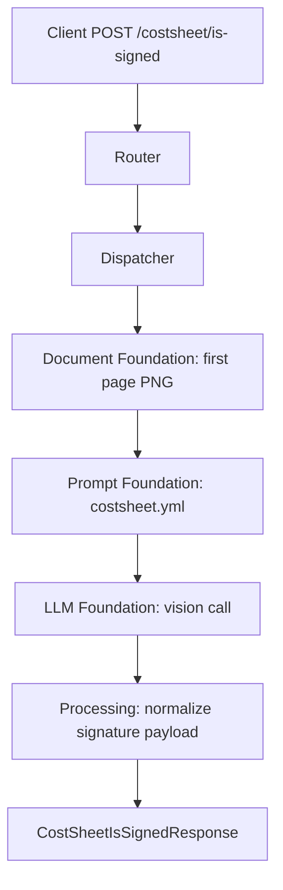

# Costsheet Is Signed API

Detects whether the AP, FC, CFO, and MD signature blocks on a cost sheet contain real handwritten signatures.

## V1_REQUIREMENT

- Accept one uploaded PDF or image as `file`.
- For PDFs, analyze first page only.
- Return `is_all_signed` and per-role signature flags under `signed_by`.
- Treat only real handwritten pen ink as signed.
- Preserve direct async request/response behavior.

## Endpoint

POST `/costsheet/is-signed`

## Description

This endpoint checks the four left-margin cost sheet approval blocks and returns whether all required roles signed the document.

## Headers

| Header | Required | Value |
| --- | --- | --- |
| `Content-Type` | Yes | `multipart/form-data` |

## API Parameters

| Name | Location | Type | Required | Description |
| --- | --- | --- | --- | --- |
| `file` | form file | PDF/JPG/JPEG/PNG | Yes | Cost sheet document. PDFs use first page only. |

## E2E Workflow

1. Router receives uploaded cost sheet.
2. Dispatcher creates `SingleDocumentCommand`.
3. Orchestrator validates file type and renders first page to PNG.
4. Prompt foundation loads `costsheet.yml`.
5. LLM foundation checks signature blocks.
6. Processing accepts current nested output or legacy flat LLM keys, then normalizes into response model.
7. Router returns signature flags and metadata.



## Request Schema

```text
multipart/form-data

file: binary file, required
```

## Response Schema

```json
{
  "is_all_signed": true,
  "signed_by": {
    "cfo": true,
    "fc": true,
    "md": true,
    "ap": true
  },
  "metadata": {
    "input_tokens": 0,
    "output_tokens": 0,
    "total_tokens": 0,
    "cost_incurred": 0.0,
    "cost_currency": "USD",
    "latency_ms": 0.0,
    "model": "gpt-4o"
  }
}
```

## Example Request

```bash
curl -X POST \
  "http://localhost:8000/costsheet/is-signed" \
  -H "accept: application/json" \
  -F "file=@./samples/costsheet.pdf;type=application/pdf"
```

## Example Response

```json
{
  "is_all_signed": false,
  "signed_by": {
    "cfo": true,
    "fc": true,
    "md": false,
    "ap": true
  },
  "metadata": {
    "input_tokens": 500,
    "output_tokens": 70,
    "total_tokens": 570,
    "cost_incurred": 0.00195,
    "cost_currency": "USD",
    "latency_ms": 1305.8,
    "model": "gpt-4o"
  }
}
```

## Error Responses

| Status | When | Shape |
| --- | --- | --- |
| `400` | Missing file, unsupported type, unreadable PDF/image | `{"detail": "..."}` |
| `502` | LLM JSON is invalid or fails response schema | `{"detail": "LLM response could not be validated: ..."}` |
| `503` | Required prompt/config is missing | `{"detail": "..."}` |
| `500` | Unexpected workflow failure | `{"detail": "Signature detection failed: ..."}` |

## Swagger Docs Details

Open Swagger UI at `/docs`.

Swagger should show:

- Tag: `costsheet`
- Method: `POST`
- Path: `/costsheet/is-signed`
- Summary: `Detect handwritten signatures on a cost sheet (PDF first page or image)`
- Request body: `multipart/form-data`
- Response model: `CostSheetIsSignedResponse`
- File field: `file`

## Future Requirement Slots

### V2_REQUIREMENT

Add here if the API later needs confidence scores, cropped proof images, bounding boxes, or extra approver roles.
