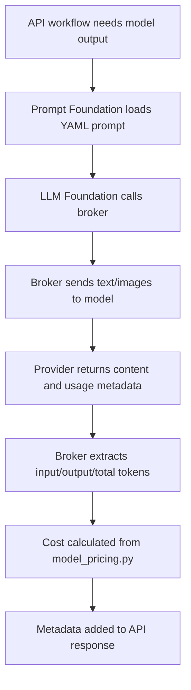

# LLM Token Consumption And Cost Metadata

This document explains how token usage happens in this project and how the API response metadata is produced.

The main code paths are:

```text
src/brokers/langchain_openai_broker.py
src/config/model_pricing.py
src/models/api/response.py
```

## Simple Explanation

Every LLM call sends input to the model and receives output from the model.

The model provider reports token usage for that call:

```text
input_tokens  = tokens sent to the model
output_tokens = tokens generated by the model
total_tokens  = input_tokens + output_tokens
```

This project stores those values in the API response metadata.

Example:

```json
{
  "metadata": {
    "input_tokens": 1200,
    "output_tokens": 350,
    "total_tokens": 1550,
    "cost_incurred": 0.0065,
    "cost_currency": "USD",
    "latency_ms": 2400.55,
    "model": "gpt-4o"
  }
}
```

## What Counts As Input Tokens

Input tokens can come from:

- System prompt text from `config/prompts/*.yml`
- User prompt text
- JSON text sent to a text model, such as stock-sheet row cleaner batches
- Image inputs sent to a vision model

For vision calls, images are sent as base64 data URLs in the broker. The model provider calculates the token cost of image understanding internally and returns usage metadata.

## What Counts As Output Tokens

Output tokens are the model's generated response.

In this project, output is usually JSON:

```json
{
  "is_signed": true,
  "is_sealed": false
}
```

Longer JSON responses consume more output tokens.

For example:

- Bank advice signature check has small output.
- Shipment LPO extraction has larger output because it includes many fields and line items.
- Stock-sheet cleaner can have larger output because it returns rows.

## Where Metadata Is Captured

The LLM broker calls LangChain `ChatOpenAI`.

After the call, it reads:

```text
response.response_metadata
```

Then it extracts token usage from either:

```text
token_usage
```

or:

```text
usage_metadata
```

The broker supports both shapes because different SDK/model responses can expose usage slightly differently.

## Metadata Fields

| Field | Meaning |
| --- | --- |
| `input_tokens` | Tokens sent to the model. |
| `output_tokens` | Tokens generated by the model. |
| `total_tokens` | Total tokens for the call. |
| `cost_incurred` | Estimated USD cost using `src/config/model_pricing.py`. |
| `cost_currency` | Always `USD` in V1. |
| `latency_ms` | Time taken for the model call, in milliseconds. |
| `model` | Model configured by `MODEL_TO_USE`. |

## Cost Formula

Pricing is configured per 1 million tokens in:

```text
src/config/model_pricing.py
```

Formula:

```text
input_cost = (input_tokens / 1,000,000) * input_price_per_1m
output_cost = (output_tokens / 1,000,000) * output_price_per_1m
cost_incurred = input_cost + output_cost
```

Example using `gpt-4o`:

```text
input price  = 2.50 USD per 1M input tokens
output price = 10.00 USD per 1M output tokens

input_tokens = 10,000
output_tokens = 2,000

input_cost = (10,000 / 1,000,000) * 2.50 = 0.025
output_cost = (2,000 / 1,000,000) * 10.00 = 0.020

total cost = 0.045 USD
```

Response metadata:

```json
{
  "input_tokens": 10000,
  "output_tokens": 2000,
  "total_tokens": 12000,
  "cost_incurred": 0.045,
  "cost_currency": "USD",
  "latency_ms": 2200.12,
  "model": "gpt-4o"
}
```

## Why One API Can Have Multiple LLM Calls

Some APIs call the LLM once. Others call it multiple times.

| API | Typical LLM calls |
| --- | --- |
| `/bank-advice-doc/is-signed` | 1 vision call |
| `/costsheet/is-signed` | 1 vision call |
| `/tax_invoice_extraction` | 1 vision call |
| `/arrival-notice/extract` | 1 multi-image vision call |
| `/shipment-form` | Classification call + LPO extraction call + Rice Quality extraction call |
| `/purchase-tracker/fetch-details` | Bill extraction call, and optional Packaging List extraction call |
| `/extract/stock-sheet` | Orientation calls, signature call, optional cleaner calls |

## Metadata Aggregation

If an API has multiple LLM calls, the API usually combines metadata.

For shipment form:

```text
classification metadata
+ LPO extraction metadata
+ Rice Quality extraction metadata
= response metadata
```

For purchase tracker with packaging list:

```text
bill metadata
+ packaging list metadata
= response metadata
```

For stock sheet:

```text
orientation metadata
+ signature metadata
+ cleaner metadata
= stock-sheet metadata
```

## Practical Example: Shipment Form

Assume `/shipment-form` performs three LLM calls:

```text
1. Classification:
   input_tokens = 900
   output_tokens = 120

2. LPO extraction:
   input_tokens = 1800
   output_tokens = 700

3. Rice Quality extraction:
   input_tokens = 1200
   output_tokens = 500
```

Aggregated metadata:

```text
input_tokens = 900 + 1800 + 1200 = 3900
output_tokens = 120 + 700 + 500 = 1320
total_tokens = 5220
```

If model is `gpt-4o`:

```text
input_cost = (3900 / 1,000,000) * 2.50 = 0.00975
output_cost = (1320 / 1,000,000) * 10.00 = 0.01320
total cost = 0.02295 USD
```

Response:

```json
{
  "metadata": {
    "input_tokens": 3900,
    "output_tokens": 1320,
    "total_tokens": 5220,
    "cost_incurred": 0.02295,
    "cost_currency": "USD",
    "latency_ms": 6400.8,
    "model": "gpt-4o"
  }
}
```

## Why Token Usage Can Change

Token usage can change when:

- Prompt text changes in `config/prompts/*.yml`
- Model changes through `MODEL_TO_USE`
- Uploaded document has more pages or larger/more complex images
- Extraction output has more fields or more line items
- Stock-sheet OCR cleaner receives more rows
- Requirements change and more JSON fields are added

## How To Reduce Token Consumption

Use these options carefully:

- Keep prompts clear but avoid repeated text.
- Send only required pages for an API.
- Keep output schemas focused.
- Avoid asking the model for explanations when only JSON is needed.
- Batch stock-sheet cleaner rows using a sensible `STOCK_SHEET_LLM_BATCH_SIZE`.
- Add deterministic processing when a value can be calculated without the LLM.

## Important Notes

- `cost_incurred` is an estimate based on the local pricing table.
- If provider pricing changes, update `src/config/model_pricing.py`.
- If the model response does not include usage metadata, token fields can be `0`.
- Token consumption is not the same as file size; image complexity and model-specific vision accounting matter.
- The calculation logic for shipment is deterministic and does not consume LLM tokens. Only extraction/classification calls consume tokens.

## Mermaid Flow


