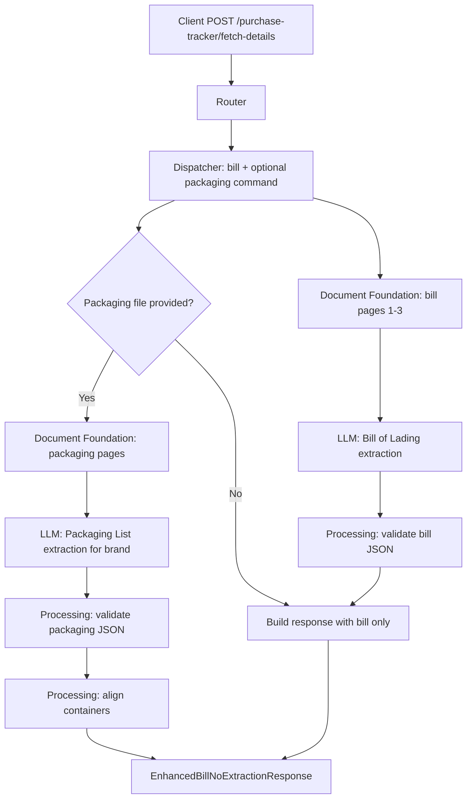

# Purchase Tracker Fetch Details API

Extracts structured Bill of Lading data and optionally extracts Packaging List data for a target brand, then aligns bill containers against packaging-list containers.

## V1_REQUIREMENT

- Accept required Bill of Lading upload as `file`.
- Accept optional Packaging List upload as `packaging_list_file`.
- Require `packaging_brand` when `packaging_list_file` is provided.
- For Bill of Lading PDFs, process up to 3 pages.
- For Packaging List PDFs, reject files above the configured max pages, currently 2.
- Return bill data, optional packaging-list data, and aggregated metadata.
- Preserve direct async request/response behavior.

## Endpoint

POST `/purchase-tracker/fetch-details`

## Description

This endpoint extracts shipping details from a Bill of Lading. If a Packaging List and brand are supplied, it also extracts brand-specific packaging details and filters/aligned bill containers to the packaging-list containers.

## Headers

| Header | Required | Value |
| --- | --- | --- |
| `Content-Type` | Yes | `multipart/form-data` |

## API Parameters

| Name | Location | Type | Required | Description |
| --- | --- | --- | --- | --- |
| `file` | form file | PDF/JPG/JPEG/PNG | Yes | Bill of Lading document. PDFs use up to 3 pages. |
| `packaging_list_file` | form file | PDF/JPG/JPEG/PNG | No | Packaging List document. Used only with `packaging_brand`. |
| `packaging_brand` | form field | string | Conditional | Required when `packaging_list_file` is provided. |

## E2E Workflow

1. Router receives bill upload and optional packaging upload/brand.
2. Dispatcher validates conditional packaging brand requirement.
3. Orchestrator renders up to 3 bill pages.
4. LLM extracts structured Bill of Lading JSON.
5. Processing validates and maps bill output into flat bill response data.
6. If packaging file and brand exist, orchestrator renders packaging pages and runs packaging extraction.
7. Processing validates packaging output and aligns bill containers to packaging containers.
8. Metadata is aggregated across bill and packaging calls.
9. Response returns `bill_extracted_data`, optional `packaging_list`, and `metadata`.



## Request Schema

```text
multipart/form-data

file: binary file, required
packaging_list_file: binary file, optional
packaging_brand: string, required only when packaging_list_file exists
```

## Response Schema

```json
{
  "bill_extracted_data": {
    "bill_no": "string|null",
    "shipped_on_board_date": "YYYY-MM-DD|null",
    "port_of_loading": "string|null",
    "port_of_discharge": "string|null",
    "number_of_containers": 0,
    "number_of_bags": 0,
    "quantity_mt": 0,
    "shipping_line": "string|null",
    "free_detention_days": 0,
    "maximum_detention_days": 0,
    "freight_prepaid": true,
    "vessel_name": "string|null",
    "invoice_number": "string|null",
    "containers": [
      {
        "container_no": "string",
        "pkg_ct": 0
      }
    ]
  },
  "packaging_list": {
    "brand": "string|null",
    "production_date": "string|null",
    "expiry_date": "string|null",
    "packing_description": "string|null",
    "container_info": [
      {
        "container_number": "string",
        "no_of_bags": 0,
        "gross_weight": "string|null",
        "net_weight": "string|null"
      }
    ],
    "total_bags": 0,
    "total_gross_weight": "string|null",
    "total_net_weight": "string|null",
    "container_number_list": ["string"]
  },
  "metadata": {
    "input_tokens": 0,
    "output_tokens": 0,
    "total_tokens": 0,
    "cost_incurred": 0.0,
    "cost_currency": "USD",
    "latency_ms": 0.0,
    "model": "gpt-4o"
  }
}
```

## Example Request

```bash
curl -X POST \
  "http://localhost:8000/purchase-tracker/fetch-details" \
  -H "accept: application/json" \
  -F "file=@./samples/bill_of_lading.pdf;type=application/pdf" \
  -F "packaging_list_file=@./samples/packaging_list.pdf;type=application/pdf" \
  -F "packaging_brand=ROYAL HORIZON"
```

## Example Response

```json
{
  "bill_extracted_data": {
    "bill_no": "AKI0630692",
    "shipped_on_board_date": "2026-05-02",
    "port_of_loading": "KARACHI-PAKISTAN",
    "port_of_discharge": "KHOR AL FAKKAN",
    "number_of_containers": 1,
    "number_of_bags": 1250,
    "quantity_mt": 25,
    "shipping_line": "CMA CGM",
    "free_detention_days": 14,
    "maximum_detention_days": 21,
    "freight_prepaid": false,
    "vessel_name": "LILA MUMBAI / 0TO3XW1MA",
    "invoice_number": "MRRM-2026-609",
    "containers": [
      {
        "container_no": "FCIU2664293",
        "pkg_ct": 1250
      }
    ]
  },
  "packaging_list": {
    "brand": "ROYAL HORIZON",
    "production_date": "06/2025",
    "expiry_date": "08/2027",
    "packing_description": "20KG POUCH BAG",
    "container_info": [
      {
        "container_number": "FCIU2664293",
        "no_of_bags": 1250,
        "gross_weight": "25292.00 KGS",
        "net_weight": "25000.00 KGS"
      }
    ],
    "total_bags": 1250,
    "total_gross_weight": "25292.00 KGS",
    "total_net_weight": "25000.00 KGS",
    "container_number_list": ["FCIU2664293"]
  },
  "metadata": {
    "input_tokens": 1500,
    "output_tokens": 950,
    "total_tokens": 2450,
    "cost_incurred": 0.01325,
    "cost_currency": "USD",
    "latency_ms": 3900.1,
    "model": "gpt-4o"
  }
}
```

## Error Responses

| Status | When | Shape |
| --- | --- | --- |
| `400` | Missing bill file, unsupported type, packaging brand missing, PDF too large | `{"detail": "..."}` |
| `502` | LLM output cannot be validated | `{"detail": "LLM response could not be validated: ..."}` |
| `503` | Required prompt/config is missing | `{"detail": "..."}` |
| `500` | Unexpected workflow failure | `{"detail": "Bill extraction failed: ..."}` |

## Swagger Docs Details

Open Swagger UI at `/docs`.

Swagger should show:

- Tag: `purchase-tracker`
- Method: `POST`
- Path: `/purchase-tracker/fetch-details`
- Summary: `Extract structured Bill of Lading and Packaging List data`
- Request body: `multipart/form-data`
- Response model: `EnhancedBillNoExtractionResponse`
- File fields: `file`, `packaging_list_file`
- Form field: `packaging_brand`

## Future Requirement Slots

### V2_REQUIREMENT

Add here if the API later needs multiple packaging lists, S3/object-key input, container mismatch warnings in the public response, or separate bill-only and bill-plus-packaging endpoints.
