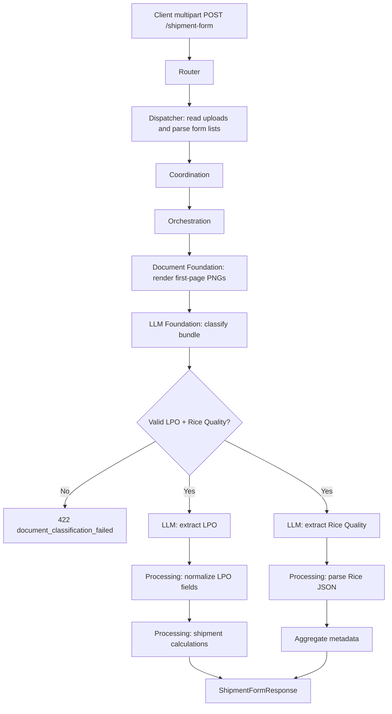

# Shipment Form API

Classifies and extracts a shipment bundle made of one LPO invoice and one Rice Quality Report, then calculates shipment logistics from the extracted LPO line items.

## V1_REQUIREMENT

The V1 API must preserve the current multipart contract:

- Accept exactly two uploaded documents: `lpo_invoice` and `rice_quality_report`.
- Accept optional `inco_terms_list` and `suppliers` form values as JSON arrays or comma-separated strings.
- Use direct async request/response execution with no job ID or background queue.
- Convert PDFs to first-page PNGs for this workflow.
- Run document classification before extraction.
- Return `422` if classification says the pair is not a valid shipment bundle.
- Run LPO and Rice Quality extraction in parallel after classification succeeds.
- Return the same public response shape as `ShipmentFormResponse`.

## Endpoint

POST `/shipment-form`

## Description

This endpoint validates two uploaded documents, classifies whether they represent an LPO plus Rice Quality Report bundle, extracts structured fields with the LLM layer, aggregates LLM metadata, and calculates shipment logistics such as FCL, bags, pallets, quantity in MT, price per container, and price per MT.

Detailed calculation explanation:

```text
docs/shipment-form/calculation_logic.md
```

## Headers

| Header | Required | Value |
| --- | --- | --- |
| `Content-Type` | Yes | `multipart/form-data` |

## API Parameters

| Name | Location | Type | Required | Description |
| --- | --- | --- | --- | --- |
| `lpo_invoice` | form file | PDF/JPG/JPEG/PNG | Yes | LPO invoice. PDFs use first page only. |
| `rice_quality_report` | form file | PDF/JPG/JPEG/PNG | Yes | Rice Quality Report. PDFs use first page only. |
| `inco_terms_list` | form field | JSON array string or CSV | No | Allowed INCO terms. Defaults to `["CIF","FOB","EXWORKS","C&F"]`. |
| `suppliers` | form field | JSON array string or CSV | No | Supplier names used to guide vendor matching in the LPO prompt. |

## E2E Workflow

1. Router receives multipart files and optional form fields.
2. Dispatcher reads `UploadFile` bytes and builds `ShipmentFormCommand`.
3. Orchestrator loads default INCO terms if none were provided.
4. Document foundation converts both documents to first-page PNG bytes.
5. LLM foundation classifies the two document images.
6. If classification fails, router returns `422` with classification details.
7. LPO extraction and Rice Quality extraction run concurrently.
8. Processing normalizes LPO fields, maps INCO terms, normalizes UOM/packaging, and parses Rice Quality JSON.
9. Processing calculates shipment logistics from LPO line items.
10. Response returns LPO data, Rice Quality data, classification data, shipment calculations, and aggregated metadata.



## Request Schema

```text
multipart/form-data

lpo_invoice: binary file, required
rice_quality_report: binary file, required
inco_terms_list: optional string
suppliers: optional string
```

Example optional form values:

```json
{
  "inco_terms_list": "[\"CIF\",\"FOB\",\"EXWORKS\",\"C&F\"]",
  "suppliers": "[\"LEKH RAJ\",\"M RAHEEM RICE PROCESSING MILLS\"]"
}
```

## Response Schema

```json
{
  "lpo_invoice": {
    "po_number": "string|null",
    "po_date": "string|null",
    "vendor": "string|null",
    "vendor_email": "string|null",
    "port_of_loading": "string|null",
    "port_of_discharge": "string|null",
    "bank_name": "string|null",
    "pi_number": "string|null",
    "pi_date": "string|null",
    "inco_terms": "string|null",
    "payment_terms": "string|null",
    "vat": "string|null",
    "total_amount": "string|null",
    "quality": "string|null",
    "items": [
      {
        "item_code": "string|null",
        "commodity": "string|null",
        "item": "string|null",
        "quantity_in_bags": "string|null",
        "unit": "string|null",
        "price": "string|null",
        "packaging": "string|null",
        "buying_unit": "string|null"
      }
    ]
  },
  "metadata": {
    "input_tokens": 0,
    "output_tokens": 0,
    "total_tokens": 0,
    "cost_incurred": 0.0,
    "cost_currency": "USD",
    "latency_ms": 0.0,
    "model": "gpt-4o"
  },
  "shipment_calculations": {
    "container_size": 20,
    "quantity_in_mt": 480.0,
    "fcl": 20,
    "bags": 48000,
    "bags_per_container": 2400,
    "pallets": 960,
    "fcl_per_unit": 23520.0,
    "price_per_mt": 980.0
  },
  "classified_data": {
    "is_valid_document": true,
    "has_lpo": true,
    "has_ricequality_doc": true,
    "reason": ""
  },
  "s1_quality_report": {}
}
```

## Example Request

```bash
curl -X POST \
  "http://localhost:8000/shipment-form" \
  -H "accept: application/json" \
  -F "lpo_invoice=@./samples/lpo_invoice.pdf;type=application/pdf" \
  -F "rice_quality_report=@./samples/rice_quality_report.pdf;type=application/pdf" \
  -F "inco_terms_list=[\"CIF\",\"FOB\",\"EXWORKS\",\"C&F\"]" \
  -F "suppliers=[\"LEKH RAJ\",\"M RAHEEM RICE PROCESSING MILLS\"]"
```

## Example Response

```json
{
  "lpo_invoice": {
    "po_number": "PC01/26/00635",
    "po_date": "2026-03-03",
    "vendor": "LEKH RAJ",
    "vendor_email": "sales@example.com",
    "port_of_loading": "KARACHI",
    "port_of_discharge": "JEBEL ALI",
    "bank_name": "ABC BANK",
    "pi_number": "PI 236",
    "pi_date": "2026-02-12",
    "inco_terms": "CIF",
    "payment_terms": "100% CAD Bank to Bank",
    "vat": "0.00",
    "total_amount": "470,400.00",
    "quality": "As per specification",
    "items": [
      {
        "item_code": "1-RH1-01B-0056",
        "commodity": "Rice",
        "item": "Rice - Goldasteh Long Grain Sella Rice 1718 - 10 Kg",
        "quantity_in_bags": "48,000.00",
        "unit": "9.80",
        "price": "470,400.00",
        "packaging": "1X10KG",
        "buying_unit": "BAG"
      }
    ]
  },
  "metadata": {
    "input_tokens": 1200,
    "output_tokens": 800,
    "total_tokens": 2000,
    "cost_incurred": 0.011,
    "cost_currency": "USD",
    "latency_ms": 4200.5,
    "model": "gpt-4o"
  },
  "shipment_calculations": {
    "container_size": 20,
    "quantity_in_mt": 480.0,
    "fcl": 20,
    "bags": 48000,
    "bags_per_container": 2400,
    "pallets": 960,
    "fcl_per_unit": 23520.0,
    "price_per_mt": 980.0
  },
  "classified_data": {
    "is_valid_document": true,
    "has_lpo": true,
    "has_ricequality_doc": true,
    "reason": ""
  },
  "s1_quality_report": {
    "sample_details": {
      "shipment_no_batch_no": "SR/050"
    }
  }
}
```

## Error Responses

| Status | When | Shape |
| --- | --- | --- |
| `400` | Missing file, invalid file type, unreadable image/PDF | `{"detail": "..."}` |
| `422` | Classification says documents are not a valid shipment bundle | Structured `document_classification_failed` detail |
| `502` | LLM output cannot be parsed or validated | `{"detail": "LLM response could not be validated: ..."}` |
| `503` | Missing prompt/config | `{"detail": "..."}` |
| `500` | Unexpected workflow failure | `{"detail": "Document extraction failed: ..."}` |

## Swagger Docs Details

Open Swagger UI at `/docs`.

Swagger should show:

- Tag: `extraction`
- Method: `POST`
- Path: `/shipment-form`
- Summary: `Classify and extract LPO and Rice Quality Report`
- Request body: `multipart/form-data`
- Response model: `ShipmentFormResponse`
- File fields: `lpo_invoice`, `rice_quality_report`
- Form fields: `inco_terms_list`, `suppliers`

## Future Requirement Slots

### V2_REQUIREMENT

Potential future changes can add S3/object-key ingestion, multi-page shipment extraction, or async job status endpoints without changing processing logic. Add the new requirement here before changing the API contract.
