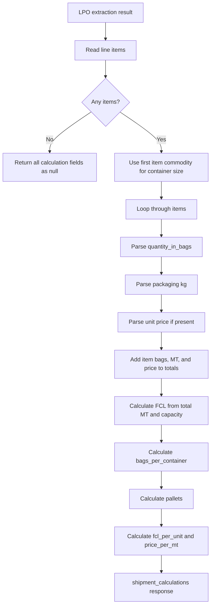

# Shipment Form Calculation Logic

This document explains how `shipment_calculations` works for `POST /shipment-form` in simple project-specific language.

The calculation code lives in:

```text
src/processing/shipment/shipment_calculations.py
```

The API documentation lives in:

```text
docs/shipment-form/api_docs.md
```

## What This API Calculates

After the LPO invoice is extracted, the API adds this object to the response:

```json
{
  "shipment_calculations": {
    "container_size": 20,
    "quantity_in_mt": 600.0,
    "fcl": 24,
    "bags": 15000,
    "bags_per_container": 625,
    "pallets": 300,
    "fcl_per_unit": 14000.0,
    "price_per_mt": 560.0
  }
}
```

In simple words:

- `container_size`: Which container size to use, such as 20ft.
- `quantity_in_mt`: Total shipment weight in metric tons.
- `fcl`: Number of full containers needed.
- `bags`: Total number of bags from the LPO line items.
- `bags_per_container`: Average bags per container.
- `pallets`: Total pallets needed.
- `fcl_per_unit`: Approximate value of one full container.
- `price_per_mt`: Approximate value of one metric ton.

## Terms

| Term | Simple meaning |
| --- | --- |
| MT | Metric ton. 1 MT = 1,000 kg. |
| FCL | Full Container Load. In this API it means number of containers needed. |
| 20ft container | Container with configured capacity of 25 MT. |
| 40ft container | Container with configured capacity of 26 MT. |
| Bag | One sale/shipping unit from the LPO. |
| Pallet | Handling unit. This project assumes 50 bags per pallet. |
| Packaging | Weight per bag/unit, such as `1X40KG`, `BAG/1x40kg`, or `4X10KG`. |

## Constants Used By The Project

```text
20ft container capacity = 25 MT
40ft container capacity = 26 MT
Bags per pallet = 50
```

Commodity mapping:

```text
rice -> 20ft
sugar -> 20ft
```

If the commodity is not mapped, `container_size` becomes `null`, and FCL-related fields may also become `null`.

## Input Used By The Calculation

The calculation reads this part of the LPO extraction:

```json
{
  "lpo_invoice": {
    "items": [
      {
        "commodity": "rice",
        "quantity_in_bags": "15,000.00",
        "packaging": "1X40KG",
        "unit": "22.40"
      }
    ]
  }
}
```

Required fields per line item:

| Field | Why it matters |
| --- | --- |
| `commodity` | Used to choose container size. The first valid item decides container size. |
| `quantity_in_bags` | Used to calculate total bags and total weight. |
| `packaging` | Used to calculate kg per bag/unit. |
| `unit` | Used to calculate total price, price per container, and price per MT. |

## Real Example

Assume the LPO contains this one item:

```text
Commodity: Rice
Quantity: 15,000 bags
Packaging: BAG/1x40kg
Unit price: 22.40 per bag
```

The extraction/normalization layer converts `BAG/1x40kg` into:

```text
packaging = 1X40KG
buying_unit = BAG
commodity = rice
```

## Step 1: Choose Container Size

The project checks the first item's commodity.

```text
rice -> 20ft container
```

Result:

```text
container_size = 20
```

Because this is a 20ft container, the capacity is:

```text
container_capacity_mt = 25 MT
```

## Step 2: Parse Quantity

The quantity field may contain commas or decimals.

```text
"15,000.00" -> 15000
```

Result:

```text
item_quantity = 15000 bags
```

## Step 3: Parse Packaging Weight

The code supports simple and multi-pack packaging.

Examples:

```text
1X40KG -> 40 kg
40KG -> 40 kg
BAG/1x40kg -> 40 kg
4X10KG -> 40 kg
1X10KG -> 10 kg
```

For this example:

```text
1X40KG -> 40 kg per bag
```

Result:

```text
item_packaging_kg = 40
```

## Step 4: Calculate Item Weight In MT

Formula:

```text
item_mt = (quantity_in_bags * packaging_kg) / 1000
```

Example:

```text
item_mt = (15000 * 40) / 1000
item_mt = 600000 / 1000
item_mt = 600 MT
```

Result:

```text
quantity_in_mt = 600.0
```

## Step 5: Calculate Total Price

Formula:

```text
item_total_price = quantity_in_bags * unit_price
```

Example:

```text
item_total_price = 15000 * 22.40
item_total_price = 336000.00
```

Result:

```text
total_price = 336000.00
```

## Step 6: Calculate FCL

Formula:

```text
fcl = ceil(total_mt / container_capacity_mt)
```

The API always rounds up because you cannot book half a container in this response.

Example:

```text
fcl = ceil(600 / 25)
fcl = ceil(24)
fcl = 24
```

Result:

```text
fcl = 24
```

## Step 7: Calculate Bags Per Container

Formula used by the current code:

```text
bags_per_container = ceil(total_bags / fcl)
```

Example:

```text
bags_per_container = ceil(15000 / 24)
bags_per_container = ceil(625)
bags_per_container = 625
```

Result:

```text
bags_per_container = 625
```

Important note:

For mixed packaging, this is an average bags-per-container value across all line items, not a physical packing plan for every individual container.

## Step 8: Calculate Pallets

Formula:

```text
pallets = ceil(total_bags / 50)
```

Example:

```text
pallets = ceil(15000 / 50)
pallets = ceil(300)
pallets = 300
```

Result:

```text
pallets = 300
```

## Step 9: Calculate FCL Per Unit

In this project, `fcl_per_unit` means the average price value per full container.

Formula:

```text
fcl_per_unit = total_price / fcl
```

Example:

```text
fcl_per_unit = 336000 / 24
fcl_per_unit = 14000.00
```

Result:

```text
fcl_per_unit = 14000.0
```

## Step 10: Calculate Price Per MT

Formula:

```text
price_per_mt = total_price / total_mt
```

Example:

```text
price_per_mt = 336000 / 600
price_per_mt = 560.00
```

Result:

```text
price_per_mt = 560.0
```

## Final Response For This Example

```json
{
  "shipment_calculations": {
    "container_size": 20,
    "quantity_in_mt": 600.0,
    "fcl": 24,
    "bags": 15000,
    "bags_per_container": 625,
    "pallets": 300,
    "fcl_per_unit": 14000.0,
    "price_per_mt": 560.0
  }
}
```

## Multi-Item LPO Example

The API supports multiple LPO line items.

Example:

```text
Item 1:
  commodity = rice
  quantity = 10000 bags
  packaging = 1X40KG
  unit = 22.40

Item 2:
  commodity = rice
  quantity = 5000 bags
  packaging = 1X10KG
  unit = 6.00
```

Item 1:

```text
MT = (10000 * 40) / 1000 = 400 MT
price = 10000 * 22.40 = 224000
```

Item 2:

```text
MT = (5000 * 10) / 1000 = 50 MT
price = 5000 * 6.00 = 30000
```

Totals:

```text
total_bags = 10000 + 5000 = 15000
total_mt = 400 + 50 = 450 MT
total_price = 224000 + 30000 = 254000
```

Container size:

```text
first item commodity = rice
container_size = 20
container_capacity = 25 MT
```

FCL:

```text
fcl = ceil(450 / 25) = 18
```

Bags per container:

```text
bags_per_container = ceil(15000 / 18) = 834
```

Pallets:

```text
pallets = ceil(15000 / 50) = 300
```

FCL per unit:

```text
fcl_per_unit = 254000 / 18 = 14111.11
```

Price per MT:

```text
price_per_mt = 254000 / 450 = 564.44
```

Final calculation:

```json
{
  "shipment_calculations": {
    "container_size": 20,
    "quantity_in_mt": 450.0,
    "fcl": 18,
    "bags": 15000,
    "bags_per_container": 834,
    "pallets": 300,
    "fcl_per_unit": 14111.11,
    "price_per_mt": 564.44
  }
}
```

## What If Data Is Missing

If no LPO is available:

```json
{
  "container_size": null,
  "quantity_in_mt": null,
  "fcl": null,
  "bags": null,
  "bags_per_container": null,
  "pallets": null,
  "fcl_per_unit": null,
  "price_per_mt": null
}
```

If the item has no quantity or no packaging, that item is skipped.

If all items are skipped:

```text
container_size may still be present if commodity was known
quantity_in_mt = null
fcl = null
bags = null
bags_per_container = null
pallets = null
fcl_per_unit = null
price_per_mt = null
```

If unit price is missing:

```text
weight, bags, FCL, and pallets can still be calculated
fcl_per_unit = null
price_per_mt = null
```

## Mermaid Calculation Diagram



## Developer Notes

- The calculation is deterministic. It does not call the LLM.
- It runs only after LPO extraction finishes.
- It uses extracted/normalized LPO values, so bad OCR or bad LLM extraction can affect the calculation.
- The calculation currently uses the first line item's commodity to decide the container size for the whole shipment.
- For future changes, update this file and `src/processing/shipment/shipment_calculations.py` together.
