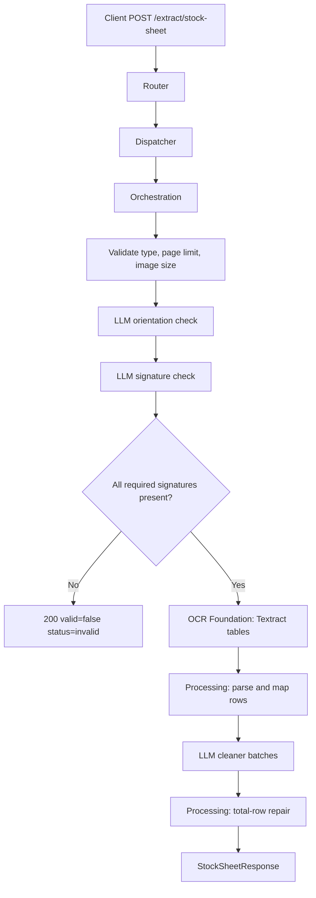

# Stock Sheet Extract API

Extracts stock-sheet table rows from a signed PDF or image using LLM signature/orientation checks and AWS Textract table OCR.

## V1_REQUIREMENT

- Accept one uploaded PDF or image as `file`.
- Return HTTP `200` for processed, invalid, and failed document outcomes.
- Use response fields `valid`, `status`, and `reason` to communicate document/workflow result.
- Reject unsupported file types with a unified invalid response.
- Reject unsigned stock sheets with a unified invalid response.
- For PDFs, enforce configured max page limit, currently 3.
- Use `boto3` Textract behind the OCR broker.
- Preserve direct async request/response behavior.

## Endpoint

POST `/extract/stock-sheet`

## Description

This endpoint validates and extracts a rice stock sheet. It checks orientation, verifies required signatures, runs OCR table extraction, optionally cleans OCR rows with an LLM, repairs the total row when possible, and returns canonical stock-sheet columns.

## Headers

| Header | Required | Value |
| --- | --- | --- |
| `Content-Type` | Yes | `multipart/form-data` |

## API Parameters

| Name | Location | Type | Required | Description |
| --- | --- | --- | --- | --- |
| `file` | form file | PDF/JPG/JPEG/PNG | Yes | Stock-sheet input document. PDFs can include up to configured max pages. |

## E2E Workflow

1. Router receives uploaded stock-sheet file.
2. Dispatcher creates `SingleDocumentCommand`.
3. Orchestrator validates file type and page/pixel limits.
4. If enabled, LLM detects orientation and pages are rotated.
5. LLM checks signatures on the first page.
6. If unsigned, API returns `200` with `valid: false` and `status: "invalid"`.
7. OCR foundation calls Textract for each page.
8. Processing merges Textract tables, maps rows to canonical columns, and optionally repairs the total row.
9. LLM cleaner can normalize noisy OCR row values in batches.
10. Response returns unified stock-sheet JSON.



## Request Schema

```text
multipart/form-data

file: binary file, required
```

## Response Schema

```json
{
  "valid": true,
  "status": "processed|invalid|failed",
  "reason": "string|null",
  "file_info": {
    "filename": "string",
    "file_type": "pdf|image|unknown",
    "pages_detected": 1,
    "pages_processed": 1
  },
  "data": {
    "headers": ["Unit", "Abu Dhabi Musaffah", "Total Bags"],
    "rows": [
      {
        "Unit": 20,
        "Abu Dhabi Musaffah": 30,
        "Total Bags": 4317
      }
    ],
    "total_rows": 1
  },
  "signature_check": {
    "prepared_by_signed": true,
    "reviewed_by_signed": true,
    "approved_by_signed": true,
    "all_signed": true,
    "notes": ""
  },
  "metadata": {
    "input_tokens": 0,
    "output_tokens": 0,
    "total_tokens": 0,
    "cost_incurred": 0.0,
    "cost_currency": "USD",
    "latency_ms": 0.0,
    "model": "gpt-4o",
    "pages_processed": 1,
    "cleanup_status": "success|partial|not_required",
    "temp_artifacts_deleted": 0
  }
}
```

## Example Request

```bash
curl -X POST \
  "http://localhost:8000/extract/stock-sheet" \
  -H "accept: application/json" \
  -F "file=@./samples/stock_sheet.pdf;type=application/pdf"
```

## Example Response

```json
{
  "valid": true,
  "status": "processed",
  "reason": null,
  "file_info": {
    "filename": "stock_sheet.pdf",
    "file_type": "pdf",
    "pages_detected": 1,
    "pages_processed": 1
  },
  "data": {
    "headers": ["Unit", "Abu Dhabi Musaffah", "ALAin Mazyad", "Total Bags"],
    "rows": [
      {
        "Unit": 20,
        "Abu Dhabi Musaffah": 30,
        "ALAin Mazyad": 3877,
        "Total Bags": 4317
      }
    ],
    "total_rows": 1
  },
  "signature_check": {
    "prepared_by_signed": true,
    "reviewed_by_signed": true,
    "approved_by_signed": true,
    "all_signed": true,
    "notes": "All required fields signed"
  },
  "metadata": {
    "input_tokens": 900,
    "output_tokens": 250,
    "total_tokens": 1150,
    "cost_incurred": 0.00475,
    "cost_currency": "USD",
    "latency_ms": 5200.2,
    "model": "gpt-4o",
    "pages_processed": 1,
    "cleanup_status": "not_required",
    "temp_artifacts_deleted": 0
  }
}
```

## Invalid Example Response

```json
{
  "valid": false,
  "status": "invalid",
  "reason": "Document is unsigned: Prepared By, Reviewed By, and Approved By signatures are required.",
  "file_info": {
    "filename": "stock_sheet.pdf",
    "file_type": "pdf",
    "pages_detected": 1,
    "pages_processed": 1
  },
  "data": {
    "headers": ["Unit", "Abu Dhabi Musaffah", "Total Bags"],
    "rows": [],
    "total_rows": 0
  },
  "signature_check": {
    "prepared_by_signed": false,
    "reviewed_by_signed": false,
    "approved_by_signed": false,
    "all_signed": false,
    "notes": "Missing signatures"
  },
  "metadata": {
    "input_tokens": 500,
    "output_tokens": 100,
    "total_tokens": 600,
    "cost_incurred": 0.00225,
    "cost_currency": "USD",
    "latency_ms": 2500.0,
    "model": "gpt-4o",
    "pages_processed": 1,
    "cleanup_status": "not_required",
    "temp_artifacts_deleted": 0
  }
}
```

## Error Responses

Most stock-sheet document failures return HTTP `200` with `valid: false`.

| HTTP Status | When | Shape |
| --- | --- | --- |
| `200` | Processed, invalid document, unsupported type, unsigned, workflow failed inside stock-sheet pipeline | `StockSheetResponse` |
| `400` | Dispatcher-level missing upload | `{"detail": "..."}` |
| `500` | Unexpected router/dispatcher failure outside stock-sheet response handling | `{"detail": "Stock-sheet extraction failed: ..."}` |

## Swagger Docs Details

Open Swagger UI at `/docs`.

Swagger should show:

- Tag: `stock-sheet`
- Method: `POST`
- Path: `/extract/stock-sheet`
- Summary: `Extract stock-sheet table rows from PDF or image`
- Request body: `multipart/form-data`
- Response model: `StockSheetResponse`
- File field: `file`

## Future Requirement Slots

### V2_REQUIREMENT

Add here if the API later needs sheet type detection, multiple stock-sheet formats, manual OCR correction fields, S3 input, or confidence scores per cell.
