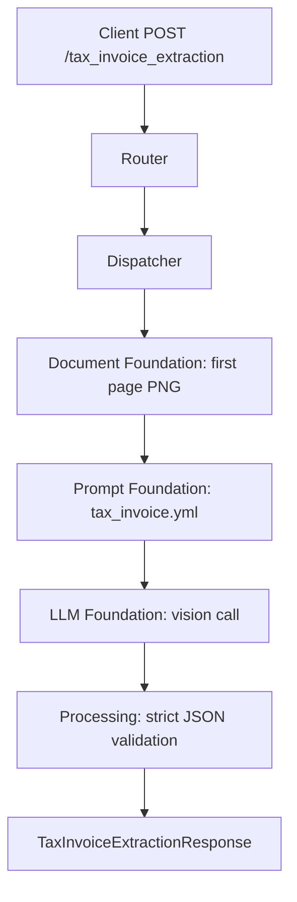

# Tax Invoice Extraction API

Extracts key fields from a tax invoice: `po_number`, `invoice_id`, `invoice_date`, and `bill_to`.

## V1_REQUIREMENT

- Accept one uploaded PDF or image as `file`.
- For PDFs, analyze first page only.
- Return only the four normalized tax invoice fields plus metadata.
- Preserve printed invoice date formatting as extracted by the model.
- Preserve direct async request/response behavior.

## Endpoint

POST `/tax_invoice_extraction`

## Description

This endpoint extracts a compact, stable set of invoice header fields for downstream systems that need PO number, invoice ID, invoice date, and billing party information.

## Headers

| Header | Required | Value |
| --- | --- | --- |
| `Content-Type` | Yes | `multipart/form-data` |

## API Parameters

| Name | Location | Type | Required | Description |
| --- | --- | --- | --- | --- |
| `file` | form file | PDF/JPG/JPEG/PNG | Yes | Tax invoice file. PDFs use first page only. |

## E2E Workflow

1. Router receives uploaded tax invoice.
2. Dispatcher creates `SingleDocumentCommand`.
3. Orchestrator validates type and renders first page to PNG.
4. Prompt foundation loads `tax_invoice.yml`.
5. LLM foundation performs one vision extraction call.
6. Processing strips JSON fences, validates strict LLM output, and normalizes blank strings to `null`.
7. Router returns `TaxInvoiceExtractionResponse`.



## Request Schema

```text
multipart/form-data

file: binary file, required
```

## Response Schema

```json
{
  "tax_invoice_extraction_result": {
    "po_number": "string|null",
    "invoice_id": "string|null",
    "invoice_date": "string|null",
    "bill_to": "string|null"
  },
  "metadata": {
    "input_tokens": 0,
    "output_tokens": 0,
    "total_tokens": 0,
    "cost_incurred": 0.0,
    "cost_currency": "USD",
    "latency_ms": 0.0,
    "model": "gpt-4o"
  }
}
```

## Example Request

```bash
curl -X POST \
  "http://localhost:8000/tax_invoice_extraction" \
  -H "accept: application/json" \
  -F "file=@./samples/tax_invoice.pdf;type=application/pdf"
```

## Example Response

```json
{
  "tax_invoice_extraction_result": {
    "po_number": "Strategic Stock Rice - 5600 MT (1st Lot)",
    "invoice_id": "TIN01/41510",
    "invoice_date": "13.04.2026",
    "bill_to": "SILAL FOOD AND TECHNOLOGY LLC"
  },
  "metadata": {
    "input_tokens": 480,
    "output_tokens": 90,
    "total_tokens": 570,
    "cost_incurred": 0.0021,
    "cost_currency": "USD",
    "latency_ms": 1450.7,
    "model": "gpt-4o"
  }
}
```

## Error Responses

| Status | When | Shape |
| --- | --- | --- |
| `400` | Missing file, unsupported type, unreadable PDF/image | `{"detail": "..."}` |
| `502` | LLM JSON is invalid or fails response schema | `{"detail": "LLM response could not be validated: ..."}` |
| `503` | Required prompt/config is missing | `{"detail": "..."}` |
| `500` | Unexpected workflow failure | `{"detail": "Extraction failed: ..."}` |

## Swagger Docs Details

Open Swagger UI at `/docs`.

Swagger should show:

- Tag: `tax-invoice`
- Method: `POST`
- Path: `/tax_invoice_extraction`
- Summary: `Extract key fields from tax invoice (PDF first page or image)`
- Request body: `multipart/form-data`
- Response model: `TaxInvoiceExtractionResponse`
- File field: `file`

## Future Requirement Slots

### V2_REQUIREMENT

Add here if the API later needs VAT/TRN extraction, invoice totals, line items, multi-page extraction, or vendor-specific invoice schemas.
